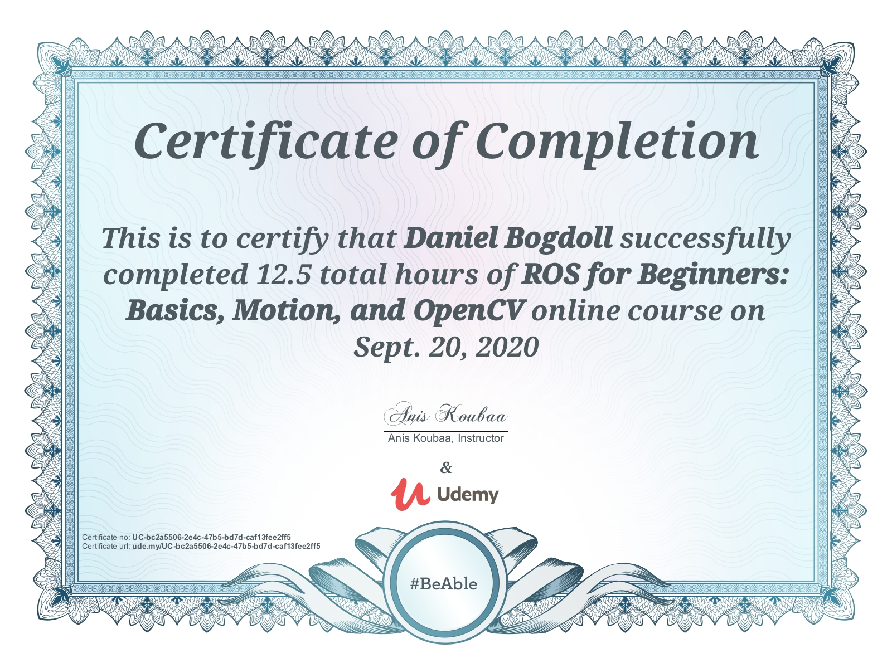

# Robot Operating System ROS
This repository covers my participation in the Udemy courses
- [ROS Fundamentals](https://www.udemy.com/course/ros-essentials/) (2020) :white_check_mark:
- [ROS Navigation](https://www.udemy.com/course/ros-navigation/) :hourglass:

They are held by [Prof. Koubaa](https://www.psu.edu.sa/faculty-details/335) and build upon his [CS460 Introduction to Robotics](https://www.psu.edu.sa/CCIS/cs-cd) course at [PSU Prince Sultan University, Center of Excellence Robotics and Internet-of-Things Lab (RIOTU)](https://www.riotu-lab.org/)

The courses cover
- ROS Essentials with TurtleSim
- TurtleBot with RViz
- OpenCV with CvBridge
- Gazebo Simulation Environment
- SLAM based on gmapping

My implementation is based on [Ubuntu 20.04 LTS](https://releases.ubuntu.com/20.04/) with [ROS Noetic](http://wiki.ros.org/noetic/Installation/Ubuntu) under Windows 10 WSL for the first course. For the second course I used [Ubuntu 18.04 LTS](https://releases.ubuntu.com/18.04.5/) with [ROS Melodic](http://wiki.ros.org/melodic) and the [Turtlebot3 simulator](https://github.com/ROBOTIS-GIT/turtlebot3).

Supporting material:
- [Run .py files](https://answers.ros.org/question/10412/no-such-file-or-directory-when-using-rosrun/)
- [Access Windows files](https://www.howtogeek.com/261383/how-to-access-your-ubuntu-bash-files-in-windows-and-your-windows-system-drive-in-bash/)
- [XServer for Windows for graphical output](https://janbernloehr.de/2017/06/10/ros-windows)
- [VcSrv with WSL 2 (Worked for me without the firewall settings)](https://github.com/microsoft/WSL/issues/4106#issuecomment-658879517)
- [Turtlebot3 in ROS Noetic](https://automaticaddison.com/how-to-launch-the-turtlebot3-simulation-with-ros/)
- [OpenCV in ROS Noetic](https://automaticaddison.com/working-with-ros-and-opencv-in-ros-noetic/)
- [ROS 2 and Turtlebot3](https://ubuntu.com/blog/simulate-the-turtlebot3)

[ROS Communication Patterns](http://wiki.ros.org/ROS/Patterns/Communication):
- Topics (Publish/Subscribe) - continuous data streams
- Services - blocking call
- Actions - non-blocking background processing

